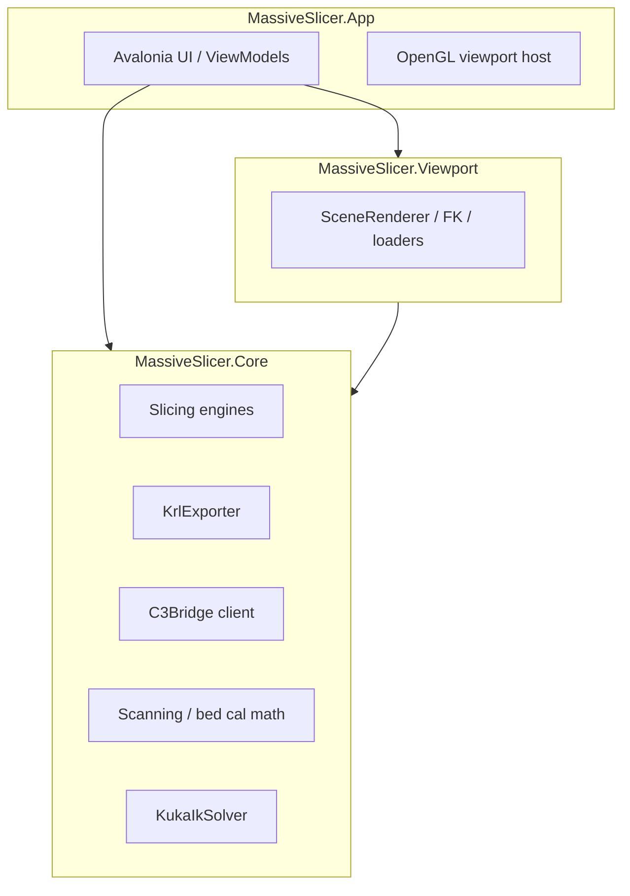
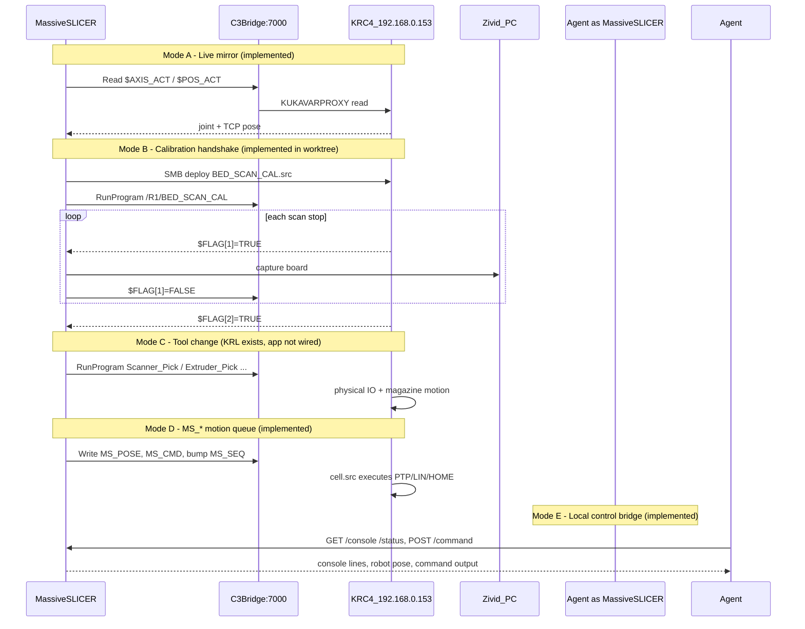
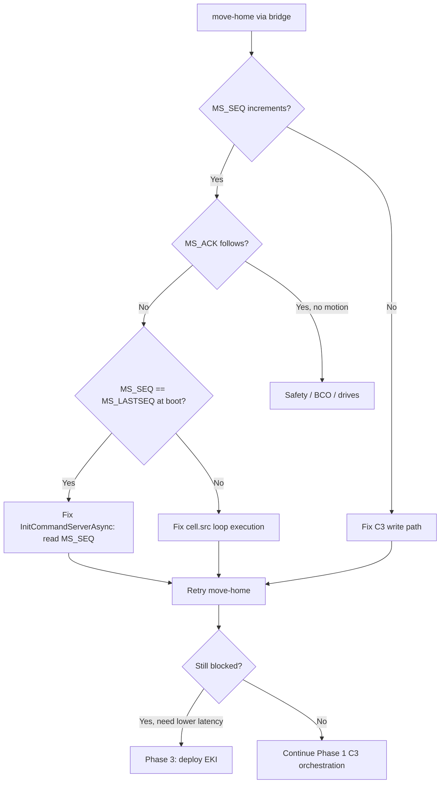

# MassiveSLICER — Robot Integration Infrastructure

> **Canonical location:** `\\192.168.0.191\MassiveFILES\Research\LFAM\MassiveSLICER V2\docs\infrastructure.md`  
> Living map of how MassiveSLICER talks to LFAM KRC4 controllers, what exists on-robot vs in-app, and how EKI fits.  
> Related: [KUKA_SETUP.md](KUKA_SETUP.md), [PROGRESS.md](PROGRESS.md)

---

## Canonical codebase

Treat these as one pipeline:

| Location | Role |
|----------|------|
| `\\192.168.0.191\MassiveFILES\Research\LFAM\MassiveSLICER V2` | **Production repo + build** — `MassiveSLICER.bat` robocopies Release binaries from here |
| `AppData\Local\MassiveSlicerBuild\worktree` | **Feature-complete dev tree** — bed cal, Zivid, C3 writes, program-run |
| `Slicing\MassiveSLICER` | **Stale local copy** — read-only C3Bridge, no scanning stack |

**Do not extend** `Slicing\MassiveSLICER` for robot orchestration. Merge/port from the worktree into this repo when ready.

---

## What MassiveSLICER is

C# / Avalonia desktop CAM for LFAM cells (KUKA KR120-class, Z-up). Four projects:



**Primary job today:** slice meshes → preview toolpaths → export `.src` print programs.

**Secondary job (partially built):** live robot mirror, rotary-bed calibration, Zivid hand-eye, remote KRL execution.

Cell config for LFAM3: `assets/cells/LFAM3/lfam3.json` — robot mesh, bed centre, rotary bed, tool TCPs (`krlIndex` 2/3/6), scanner stand docks, `bridgeIp: 192.168.0.153`.

---

## How the robot is reached today



### Local control bridge + MCP (agent / external tooling)

On app startup, `MainWindow.axaml.cs` starts `LocalControlBridge` — a **localhost HTTP API** (not the KUKA C3 bridge):

| Item | Value |
|------|-------|
| Default port | **8723** (falls back 8724–8728 if busy) |
| Bind address | `127.0.0.1` only |
| Port file | `%LOCALAPPDATA%\MassiveSlicer\bridge.port` |
| Startup log | `[bridge] control API on http://127.0.0.1:8723 — GET /status, GET /console?n=N, POST /command` |

**Source:** `src/MassiveSlicer.App/Console/LocalControlBridge.cs`

| Endpoint | Purpose |
|----------|---------|
| `GET /ping` | `{ ok, app, port }` health check |
| `GET /status` | Robot connected, tool/base indices, TCP pose |
| `GET /console?n=50` | Last N console lines (`text`, `error`, `command` flags) |
| `POST /command` | Run a console command (`{"command":"sync"}` or raw body) |

**MCP integration:** The in-app bridge is HTTP-first; an external **MCP shim** (added separately in your Grok/Cursor MCP config) wraps these endpoints so agents can read the MassiveSLICER console and send commands without manual copy/paste. The shim typically calls `bridge.port` to discover the port, then polls `/console` and posts to `/command`.

**Useful console commands** (via `POST /command` or the in-app console):

| Command | Effect |
|---------|--------|
| `sync` / `desync` | Connect/disconnect C3Bridge live feed |
| `pos` | Print TCP pose + ready-to-paste `move-pose` line |
| `move-pose x y z [a b c] [vel]` | PTP via `MS_*` / `cell.src` |
| `move-lin x y z [a b c] [vel]` | LIN via `MS_*` |
| `move-home [vel]` | HOME via `MS_CMD=4` |
| `readvar MS_SEQ MS_ACK` | Read KRL variables over C3Bridge (diagnostics) |
| `cell LFAM 3` | Switch active cell |
| `reload-cell` | Invalidate cache and reload scene |
| `help` | List all commands |

**Registry:** `src/MassiveSlicer.App/Console/ConsoleCommandRegistry.cs`

### C3Bridge client (KUKA @ port 7000)

`src/MassiveSlicer.Core/C3Bridge/C3BridgeClient.cs`

- Message types: **0** read var, **1** write var, **10** program control (select/run/start/stop)
- `RobotSyncService`: 100 ms polling + `ReadFlagAsync` / `SetFlagAsync` / `RunProgramAsync`
- **`SendPoseAsync` / `SendAxesAsync` / `GoHomeAsync`**: `MS_*` write sequence (see below)
- **Constraint:** one request in flight → auto-cal and motion commands pause streaming first

Local `Slicing\MassiveSLICER` client is an **older subset** (read-only, wrong framing).

---

## On-controller KRL inventory (LFAM3 @ 192.168.0.153)

| Program | Purpose | Host handshake |
|---------|---------|----------------|
| `cell.src` | Main dispatcher loop | `bRunScanPick/Deposit` BOOLs; **`MS_*` motion queue**; EXT PGNO 4/5 |
| `BED_SCAN_CAL.src` | Auto bed level E1 sweep | `$FLAG[1]` scan / `$FLAG[2]` done — documents MassiveSlicer |
| `SCAN_TOOL_CAL.src` | 3D scan tool (hand-eye) wrist sweep | `$FLAG[1/2/3]` — on robot, not wired in app |
| `Scanner_Pick/Deposit`, `Extruder_Pick/Deposit`, `Spindle_Pick/Deposit` | Tool changer sequences | IO + global points; runnable via C3 |
| `BaseCalibration.src` | Legacy base cal stub | minimal |

**RSI/Eidos streaming:** removed from `cell.src`. Bed/scan workflows use **C3 + $FLAG**, not RSI.

### `cell.dat` — CELL program globals

`KRC\R1\cell.dat` (verified live @ 192.168.0.153):

```
DEFDAT CELL PUBLIC
    DECL BOOL bRunScanPick    = FALSE
    DECL BOOL bRunScanDeposit = FALSE
ENDDAT
```

C3 Bridge writes these BOOLs while `CELL` is running to trigger `Scanner_Pick` / `Scanner_Deposit` without EXT PGNO.

### `MS_*` protocol — globals in `$config.dat`

`MS_*` variables are declared in **`KRC\R1\System\$config.dat`** (user globals section), not `cell.dat`. Comment references `MASSIVE_SERVER.src`, but that file is **not deployed** — motion handling is inlined in `cell.src`.

Current defaults on controller:

| Variable | Type | Default | Notes |
|----------|------|---------|-------|
| `MS_SEQ` | INT | 1 | App bumps to issue a new command |
| `MS_ACK` | INT | 0 | Set by robot when command completes |
| `MS_CMD` | INT | 1 | Motion type (see table below) |
| `MS_VEL` | INT | 20 | PTP % and CP scale (`$VEL.CP = MS_VEL/100`) |
| `MS_TOOL` | INT | 6 | Scanner `TOOL_DATA` index |
| `MS_BASE` | INT | 3 | `BASE_DATA[3]` — "KP1-MB2000 HW-2" |
| `MS_STAT` | INT | 0 | 1=running, 2=done, 3=error |
| `MS_BUSY` | BOOL | FALSE | True while executing |
| `MS_POSE` | E6POS | `{X 2175.60, Y -264.60, Z 1498.30, A -31.27, B 88.58, C -27.72}` | Cartesian target |
| `MS_AXIS` | E6AXIS | zeros (+ E1) | Joint target |

`cell.src` local scratch only: `MS_LASTSEQ` (INT), `MS_MSP` (E6POS).

### `MS_*` execution (`cell.src`)

Poll loop (20 Hz in AUT): when `MS_SEQ <> MS_LASTSEQ`, robot applies `MS_TOOL`/`MS_BASE`, clamps `MS_VEL` to 1–100, then:

| `MS_CMD` | Motion |
|----------|--------|
| 1 | PTP Cartesian (`MS_POSE`, preserve S/T from `$POS_ACT`) |
| 2 | LIN Cartesian |
| 3 | PTP joint (`MS_AXIS`) |
| 4 | HOME (`XHOME`) |

After motion: `MS_ACK=MS_SEQ`, `MS_STAT=2` (or 3 on unknown cmd), `MS_BUSY=FALSE`.

### App write sequence (C3 — implemented in V2)

`RobotSyncService.SendCommandAsync` (`src/MassiveSlicer.Core/C3Bridge/RobotSyncService.cs`):

1. `InitCommandServerAsync()` — sync host counter to `MS_ACK`
2. Write `MS_VEL`, `MS_TOOL`, `MS_BASE`, `MS_POSE`/`MS_AXIS`, `MS_CMD`
3. Bump `MS_SEQ` (monotonic int)
4. Poll until `MS_ACK == MS_SEQ` (50 ms interval, 60 s timeout)

Exposed via console (`move-pose`, `move-lin`, `move-home`) and `MainWindowViewModel.MoveServerPoseAsync`. Requires **`CELL` running** on controller (handler is in `cell.src`, not a separate `MASSIVE_SERVER.src`).

**Gap:** No dedicated UI buttons for motion yet; orchestration workflows (bed cal, tool change) not wired through the local bridge/MCP layer.

---

## Resolved — `move-home` / `move-pose` blocker (2026-06-25)

### Symptom (before fix)

Bridge `POST /command {"command":"move-home"}` logged `[srv] HOME @ 20% …` but robot did not move and `MS_ACK` never updated.

### Verified fix (2026-06-25)

```
readvar MS_SEQ MS_ACK   →  MS_SEQ=1  MS_ACK=0
move-home               →  [srv] HOME @ 20% …  [srv] At HOME.
readvar MS_SEQ MS_ACK   →  MS_SEQ=2  MS_ACK=2
```

Root cause confirmed: `InitCommandServerAsync` seeded from `MS_ACK` (0) while controller had `MS_SEQ=MS_LASTSEQ=1`, so first command wrote `MS_SEQ=1` and never triggered `cell.src`. Fix: seed from `MS_SEQ`.

### One-shot diagnostic (pendant or bridge `readvar`)

While sending `move-home`, watch on controller:

| Observation | Meaning |
|-------------|---------|
| `MS_SEQ` stays at **1** | App write not landing (C3 write path) |
| `MS_SEQ` increments, `MS_ACK` does not | `cell.src` loop not processing MS branch |
| Both increment together | Motion blocked (safety/BCO) but handler ran — check drives, `$PERI_RDY`, fault messages |
| `MS_BUSY` flickers TRUE | Handler entered; investigate motion failure inside SWITCH |

**Bridge command:** `readvar MS_SEQ MS_ACK MS_CMD MS_STAT MS_BUSY` — uses `RobotSyncService.ReadVarAsync`.

### Likely root cause: sequence counter collision (app bug)

Controller defaults (`$config.dat`):

```
MS_SEQ = 1
MS_ACK = 0
```

`cell.src` init (line 38): `MS_LASTSEQ = MS_SEQ` → both **1** after boot.

App `InitCommandServerAsync` reads **`MS_ACK`** (0), sets `_msSeq = 0`. First `GoHomeAsync` does `++_msSeq` → writes **`MS_SEQ = 1`**.

Trigger in `cell.src` is `IF MS_SEQ <> MS_LASTSEQ` — with both at **1**, the branch **never fires**. No motion, no ack. Matches the blocker exactly.

Every reconnect re-reads `MS_ACK` (still 0 if never acked) and repeats the collision on the first command.

**Fix (Phase 1, app-only, no reboot):** sync host counter from **`MS_SEQ`**, not `MS_ACK`:

```csharp
// InitCommandServerAsync — proposed
var seqStr = await _client.ReadAsync("MS_SEQ", 2000, ct);
_msSeq = int.TryParse(seqStr.Trim(), ..., out var s) ? s : 0;
// first command writes MS_SEQ = _msSeq + 1, guaranteed > MS_LASTSEQ at boot
```

Alternative controller-side: init `MS_LASTSEQ = MS_ACK` instead of `MS_SEQ` — requires `cell.src` redeploy.

### Secondary hypotheses (if seq fix doesn't resolve)

| Hypothesis | Check | Fix path |
|------------|-------|----------|
| Loop not cycling | Pendant run state "R", green I, override > 0% | Advance-run start / select+start CELL |
| C3 write fails silently | Log echoed value from `WriteAsync` for `MS_SEQ` | C3Bridge error handling |
| Streaming blocks writes | Already paused in `MoveServerHomeAsync` | — |
| Motion fault inside CASE 4 | `MS_STAT`, pendant fault window | Safety / BCO / `$MODE_OP` |

### Would EKI fix this?

**Short answer: No — not as the first move.** EKI is a transport swap, not a fix for a broken handshake.

| Root cause | EKI helps? | Notes |
|------------|------------|-------|
| `MS_SEQ`/`MS_LASTSEQ` collision | **No** | EKI uses request/response over TCP XML, not `MS_*` globals — would bypass the bug accidentally, not fix the design |
| C3 writes not landing | **No** | EKI needs its own channel (port 54600) + cold start; C3 read path already works |
| `cell.src` loop not running | **Partially** | `EMI_Server` in Submit interpreter is independent of `cell.src` dispatcher — but still needs drives on, AUT, advance run |
| Motion blocked by safety/mode | **No** | Same `BAS`, `$PERI_RDY`, BCO gates apply to EKI motion |
| C3 single-flight / ~100 ms latency | **Yes** | Direct TCP request/response, no global poll |
| Architectural coupling to boot `cell.src` | **Yes** | Cleaner separation; Submit-hosted server |
| Requires cold start | **Cost** | Blocks deployment while other processes run |

**Recommendation:**

1. **Fix MS_* handshake first** (one-line `InitCommandServerAsync` change + optional `readvar` bridge command) — minutes, no reboot.
2. **Run the one-shot diagnostic** to confirm `MS_SEQ` was stuck at 1.
3. **Defer EKI to Phase 3** for lower-latency jog/streaming once C3 orchestration is proven — not as a debug shortcut for this blocker.



---

## Workflow status matrix

### Auto Bed Level (rotary E1)

| Layer | Status |
|-------|--------|
| KRL `BED_SCAN_CAL` on controller | Deployed, v6 with arm+TCP moves + E1 rotation |
| App AUTO-CALIBRATE button | **Implemented** in worktree (`RunAutoBedCalibration`) |
| Zivid board capture + circle fit | **Implemented** (`RotaryBedCalibration`, `BedScanAnalyzer`) |
| Apply to cell JSON | **Implemented** (centre X/Y/Z, `rotationSign`) |
| Write to KRL `BASE_DATA[2]` "Base Rotary" | **Deferred** |
| `$FLAG` writable via C3 | **Unverified** on live robot (see KUKA_SETUP.md) |

### 3D Scan / Hand-Eye Calibration

| Layer | Status |
|-------|--------|
| KRL `SCAN_TOOL_CAL` (automated wrist nutation + `$FLAG[3]` retry) | **On controller only** |
| App manual pose collection + Zivid hand-eye | **Implemented** (`ScanCalibrationViewModel`) |
| Automated `SCAN_TOOL_CAL` orchestration | **Not implemented** |
| Scanner TCP in cell (`krlIndex: 6`, calibrated values in lfam3.json) | **Configured** |

### Tool Change

| Layer | Status |
|-------|--------|
| KRL sequences on controller | **Exist** (`Scanner_Pick`, `Extruder_Pick`, etc.) |
| MassiveSLICER UI to run sequences | **Missing** |
| Reference implementation | `reference/MassiveCONNECT-V2` — C3 `RunProgram`, scanner DIO watcher, `krlSequenceParser.js` for waypoint preview |
| Tool docks in lfam3.json | **Configured** per toolhead |

### Interactive jogging / setup moves

| Layer | Status |
|-------|--------|
| `MS_*` via `cell.src` + `$config.dat` | **Ready on controller** |
| `RobotSyncService.SendPoseAsync` / console `move-*` | **Implemented** in V2 |
| Local control bridge + MCP console read | **Implemented** (`LocalControlBridge` @ :8723) |
| EKI (planned) | Not deployed; optional lower-latency alternative to `MS_*` over C3 |

---

## Where EKI fits (defer until processes allow reboot)

**EKI is not a replacement for MassiveSLICER's existing stack.** It is an alternative transport for **Mode D** (queued LIN/PTP/jog) that today was sketched as `MS_*` over C3 writes.

| Concern | C3 Bridge (current) | EKI (planned) |
|---------|---------------------|---------------|
| Live pose mirror | Read `$AXIS_ACT` | Not needed |
| Run full KRL programs (bed cal, tool change) | `RunProgramAsync` | Poor fit — use C3 |
| `$FLAG` handshake during cal | Write `$FLAG[n]` | Possible but C3 already works |
| High-rate motion queue | `MS_*` over C3 (latency ~100ms) | Lower latency TCP XML |
| Requires cold start | No | Yes |

**Pragmatic split:**

- **Keep C3** for: program run, BOOL triggers, calibration handshakes, status polling
- **Add EKI later** only if: interactive jogging, dense motion streaming, or C3 single-flight becomes a bottleneck
- **Unify app-side** behind a `IRobotOrchestrator` with C3 + optional EKI backends

Initial EKI scaffold (not deployed): `Desktop\kuka-eki-motion\` (EMI protocol, KRL server, Python client).

---

## Proposed phased work (no controller changes until downtime is approved)

### Phase 0 — Align repos

- Confirm network V2 == worktree feature set (or merge worktree → V2)
- Document open verification items from PROGRESS.md: `$FLAG` writes, `BED_SCAN_CAL` program path

### Phase 1 — Complete C3-based orchestration in MassiveSLICER

0. **Unblock MS_* motion** — fix `InitCommandServerAsync` to seed `_msSeq` from `MS_SEQ` (not `MS_ACK`); add `readvar` bridge command; verify `move-home` acks
1. **`RobotOrchestrator` service** in Core — wraps read/write/run/flag/handshake patterns already in worktree
2. **Agent orchestration layer** — MCP tools wrapping local bridge (`/console`, `/command`, `/status`) for bed cal, tool change, scan workflows
3. **Tool Change panel** — run `Scanner_Pick/Deposit`, `Extruder_Pick/Deposit`, `Spindle_Pick/Deposit` via `RunProgramAsync`; show active tool from `$ACT_TOOL`
4. **`SCAN_TOOL_CAL` automation** — mirror `RunAutoBedCalibration` using `$FLAG[1/2/3]` + Zivid capture loop
5. **Port reference patterns** from MassiveCONNECT (scanner DIO at `gXB3`, sequence preview from KRL parser)

### Phase 2 — Calibration hardening

- Verify/fix `$FLAG` writability (fallback: `bScanReady`/`bScanDone` globals in `$config.dat` per KUKA_SETUP.md)
- Optional: push fitted bed centre to `BASE_DATA[2]` on controller
- Bed height map → slicer Z compensation (not started)

### Phase 3 — EKI (when safe to cold-start)

- Deploy `kuka-eki-motion` only for motion-queue/jog paths
- Keep `cell.src` as dispatcher; decide whether `MS_*` stays on C3 or migrates to EKI

---

## Critical constraints while other processes run

- **No cold start** → RSI disable + any EKI config waits
- **Running `BED_SCAN_CAL` or tool-change programs deselects `CELL`** — same as C3easy Run; coordinate with active print jobs
- **C3 single-flight** — auto-cal must pause live sync (already handled)
- **`cell.src` must stay running** for `bRunScanPick/Deposit` and `MS_*` paths; direct `RunProgram` bypasses the cell loop temporarily

---

## Key files

| Area | Path |
|------|------|
| Bed cal orchestration | `src/MassiveSlicer.App/ViewModels/MainWindowViewModel.cs` → `RunAutoBedCalibration` |
| Local control bridge (MCP/curl) | `src/MassiveSlicer.App/Console/LocalControlBridge.cs` |
| Console commands | `src/MassiveSlicer.App/Console/ConsoleCommandRegistry.cs` |
| C3 + MS_* client | `src/MassiveSlicer.Core/C3Bridge/RobotSyncService.cs` |
| C3 low-level TCP | `src/MassiveSlicer.Core/C3Bridge/C3BridgeClient.cs` |
| Hand-eye UI | `src/MassiveSlicer.App/ViewModels/ScanCalibrationViewModel.cs` |
| Controller dispatcher | `\\192.168.0.153\krc\ROBOTER\KRC\R1\cell.src` |
| CELL BOOL triggers | `\\192.168.0.153\krc\ROBOTER\KRC\R1\cell.dat` |
| MS_* global declarations | `\\192.168.0.153\krc\ROBOTER\KRC\R1\System\$config.dat` (lines ~839–850) |
| Bed cal KRL | `\\192.168.0.153\krc\ROBOTER\KRC\R1\Program\BED_SCAN_CAL.src` |
| Scan tool cal KRL | `\\192.168.0.153\krc\ROBOTER\KRC\R1\Program\SCAN_TOOL_CAL.src` |
| Tool change reference | `reference/MassiveCONNECT-V2/MassiveBOARD/services/krlSequenceParser.js` |
| EKI scaffold | `Desktop\kuka-eki-motion\` |
| Setup docs | `docs/KUKA_SETUP.md`, `docs/PROGRESS.md` |

---

## Open todos

- [x] Fix `InitCommandServerAsync` MS_SEQ seeding + add `readvar` bridge command
- [x] Verify `move-home` on LFAM3 — `MS_SEQ`/`MS_ACK` 1→2, robot at HOME
- [ ] Confirm network V2 repo matches worktree feature set; retire stale `Slicing\MassiveSLICER` for robot work
- [ ] When downtime allows: verify `$FLAG` read/write and `BED_SCAN_CAL` program path on 192.168.0.153
- [x] `MS_*` write/poll client in `RobotSyncService` + console `move-*` commands
- [ ] Document MCP shim config location + expose bridge endpoints as formal MCP tools in repo
- [ ] Wire bed cal / tool change / scan cal through local bridge for agent-driven workflows
- [ ] Add Tool Change UI: `RunProgram` for Pick/Deposit sequences + `$ACT_TOOL` feedback
- [ ] Wire `SCAN_TOOL_CAL` automated sweep (`$FLAG[1/2/3]`) + Zivid capture loop in app
- [ ] Introduce `IRobotOrchestrator` unifying C3 read/write/run/flag patterns before optional EKI
- [ ] Defer EKI cold-start deploy until C3 orchestration is complete and reboot window is available